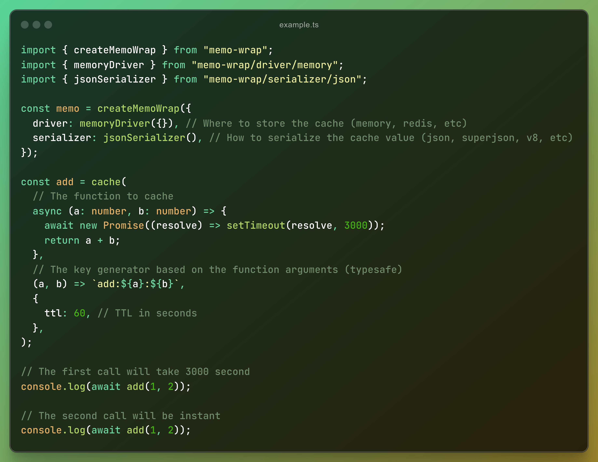

# memo-wrap

Cache the result of function calls



## Installation

```sh
npm i memo-wrap
```

## Usage

```ts
import { createMemoWrap } from "memo-wrap";
import { memoryDriver } from "memo-wrap/driver/memory";
import { jsonSerializer } from "memo-wrap/serializer/json";

const memo = createMemoWrap({
  driver: memoryDriver({}), // Where to store the cache (memory, redis, etc)
  serializer: jsonSerializer(), // How to serialize the cache value (json, superjson, v8, etc)
});

const add = memo(
  // The function to cache
  async (a: number, b: number) => {
    await new Promise((resolve) => setTimeout(resolve, 3000));
    return a + b;
  },
  // The key generator based on the function arguments (typesafe)
  (a, b) => `add:${a}:${b}`,
  {
    ttl: 60, // TTL in seconds
  },
);

// The first call will take 3 second
console.log(await add(1, 2));

// The second call will be instant
console.log(await add(1, 2));
```

You need to create a `memo` function by calling `createMemoWrap` with the following options:

- `driver`: The driver to store and retrieve the cache value.
- `serializer`: The serializer to serialize and deserialize the cache value.

Then you can create a memoized function by calling the `memo` function with the following arguments:

- `fn`: The function to cache.
- `key`: String, or a function that generates a string key based on the function arguments.
- `opts`: The options object. (optional)
  - `ttl`: The time-to-live in seconds. (optional)

The `memo` function will return a memoized function that caches the result of the function calls.
You can call the memoized function with the same arguments as the original function.

## Serializers

Serializer is used to serialize and deserialize the cache value. memo-wrap has several built-in serializers:

### JSON

```ts
import { jsonSerializer } from "memo-wrap/serializer/json";

const memo = createMemoWrap({
  serializer: jsonSerializer(),
  // ...
});
```

### SuperJSON

```ts
import { superjsonSerializer } from "memo-wrap/serializer/superjson";
import SuperJSON from "superjson";

const memo = createMemoWrap({
  serializer: superjsonSerializer({
    superjson: SuperJSON,
  }),
  // ...
});
```

### V8

```ts
import { v8Serializer } from "memo-wrap/serializer/v8";

const memo = createMemoWrap({
  serializer: v8Serializer(), // Node.js only
  // ...
});
```

### Custom Serializer

You can create your own custom serializer by using the `defineSerializer` function.
This function allows you to define how data should be serialized and deserialized before storing and retrieving it from the cache.

```ts
import { defineSerializer } from "memo-wrap/serializer/builder";

const customSerializer = defineSerializer<string, undefined>(() => {
  return {
    serialize: (data: object) => JSON.stringify(data),
    deserialize: (data: string) => JSON.parse(data),
  };
});

const memo = createMemoWrap({
  serializer: customSerializer(),
  // ...
});
```

#### Type Parameters

- `SerializedType`: The type of the serialized data.
- `Opts`: The type of the options object, which is either an object or undefined.

#### Methods

##### `serialize(data: object): SerializedType`

Serialize the data.
Returns the serialized data.

##### `deserialize(data: SerializedType): object`

Deserialize the data.
Returns the deserialized data.

## Drivers

Driver is used to store and retrieve the cache value. memo-wrap has several built-in drivers:

### Memory

```ts
import { memoryDriver } from "memo-wrap/driver/memory";

const memo = createMemoWrap({
  driver: memoryDriver({}),
  // ...
});
```

### Redis

```ts
import { Redis } from "ioredis";
import { redisDriver } from "memo-wrap/driver/redis";

const memo = createMemoWrap({
  driver: redisDriver({
    redis: new Redis(),
  }),
  // ...
});
```

### unstorage

```ts
import { unstorageDriver } from "memo-wrap/driver/unstorage";
import { createStorage } from "unstorage";
import cloudflareKVBindingDriver from "unstorage/drivers/cloudflare-kv-binding";

const memo = createMemoWrap({
  driver: unstorageDriver({
    storage: createStorage({
      driver: cloudflareKVBindingDriver({ binding: "CACHE" }),
    }),
  }),
  // ...
});
```

### Custom Driver

You can create your own custom driver by using the `defineDriver` function.
This function allows you to define how data should be stored and retrieved from the cache.

```ts
import { defineDriver } from "memo-wrap/driver/builder";

interface CustomDriverOpts {
  // Define any options your driver needs
}

const customDriver = defineDriver<string, CustomDriverOpts>((opts) => {
  return {
    async get(key) {
      // Implement your get logic here
      return null;
    },
    async set(key, value, ttl) {
      // Implement your set logic here
    },
  };
});

const memo = createMemoWrap({
  driver: customDriver({
    // Pass any options your driver needs here
  }),
  // ...
});
```

#### Type Parameters

- `SerializedType`: The type of the serialized data.
- `Opts`: The type of the options object, which is either an object or undefined.

#### Methods

##### `get(key: string): Awaitable<SerializedType | null>`

Retrieve the cache value by key.
Returns the cache value if it exists, otherwise returns `null`.

##### `set(key: string, value: SerializedType, ttl?: number): Awaitable<void>`

Store the cache value by key with a TTL.
If `ttl` is not provided, the cache value will not expire.

## License

This project is licensed under the MIT license. See the [LICENSE](LICENSE) file for more information.
